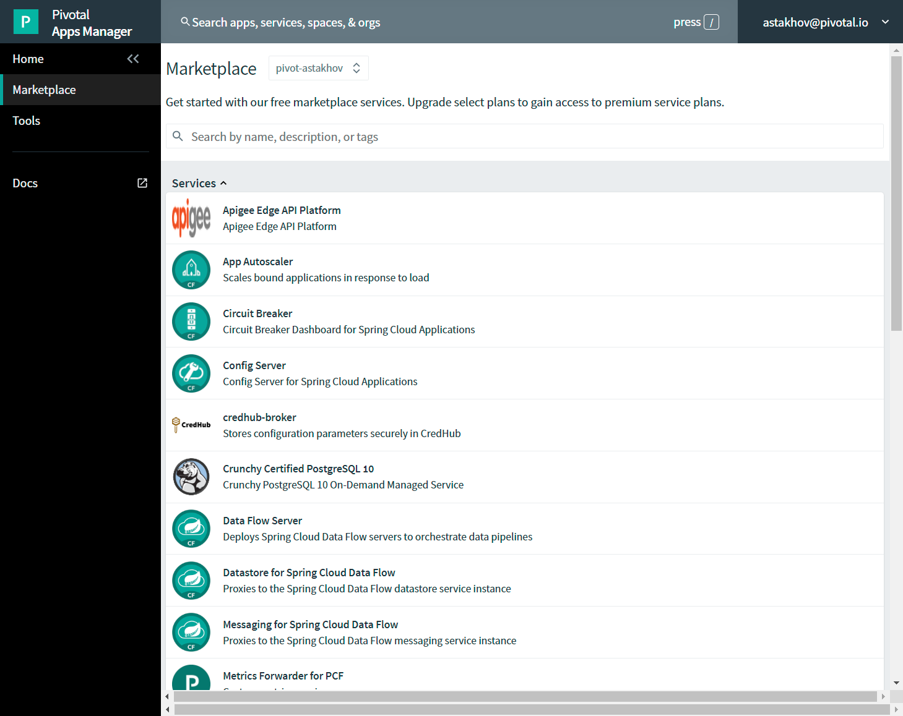

# Binding to Cloud Foundry Services

The _attendees_ application was designed to illustrate the ease with which various types of data services can be bound to and utilized by Spring applications running on Cloud Foundry.
In this lab, we'll be binding the application to a MySQL database.

Cloud Foundry services are managed through two primary types of operations:

**Create/Delete:** These operations create or delete instances of a service.
For a database this could mean creating/deleting a schema in an existing multitenant cluster or creating/deleting a dedicated database cluster.

**Bind/Unbind:** These operations create or delete unique credential sets for an existing service instance that can then be injected into the environment of an application instance.


### A Bit of Review

Your instance of _attendees_ should still be running from the end of Lab 1.
Visit the application in your browser by hitting the route that was generated by the CLI:


Take a look at the `Application Environment Information` section on the top right-hand corner of the UI.
This gives you important information about the state of the currently running _attendees_ instance, including what application instance index and what Cloud Foundry services are bound.
Let's change that.

### The Services Marketplace

There are two ways to discover what services are available on Pivotal Cloud Foundry.
The first is available on any instance of Cloud Foundry: the CLI. Just type:

```
$ cf marketplace
```

and you'll get a list of services, their available plans, and descriptions.

The second way is specific to Pivotal Cloud Foundry's Application Manager UI.
If you haven't already, login to it by visiting \https://apps.<INSTRUCTOR-PROVIDED-DOMAIN>

Click on the `Marketplace` link:


and you'll see the same service/plan/description listing in the browser:



## Creating and Binding to a Service Instance

. Let's begin by creating a Redis instance.
From the CLI, let's _create_ a developer instance:

```
cf create-service p-redis shared-vm articulate-cache
```
Here we're specifying 3 arguments: the name of the service, the plan we want to use, and the logical name of the service within the space.

Next we'll _bind_ the newly created instance to our `attendees` application:
```
$ cf bind-service articulate-ui attendees-cache
```
 Notice the admonition to `Use 'cf restage' to ensure your env variable changes take effect`.
Let's take a look at the environment variables for our application to see what's been done. We can do this by typing:
```
$ cf env articulate-ui
```
+
The subset of the output we're interested in is located near the very top, titled `System-Provided`:
```
System-Provided:                                                      
{                                                                     
 "VCAP_SERVICES": {                                                   
  "p-redis": [                                                        
   {                                                                  
    "binding_name": null,                                             
    "credentials": {                                                  
     "host": "192.168.8.27",                                          
     "password": "849648b0-2de2-4945-857c-86c67ee88548",              
     "port": 37871                                                    
    },                                                                
    "instance_name": "attendees-cache",                               
    "label": "p-redis",                                               
    "name": "attendees-cache",                                        
    "plan": "shared-vm",                                              
    "provider": null,                                                 
    "syslog_drain_url": null,                                         
    "tags": [                                                         
     "pivotal",                                                       
     "redis"                                                          
    ],                                                                
    "volume_mounts": []                                               
   }                                                                  
  ]                                                                   
 }                                                                    
}                                                                     
                                                                      
{                                                                     
 "VCAP_APPLICATION": {                                                
  "application_id": "9d665e74-c72e-4e7b-b878-87c8d4678301",           
  "application_name": "articulate-ui",                                
  "application_uris": [                                               
   "articulate-ui.apps.pcfone.io"                                     
  ],                                                                  
  "application_version": "f0109456-e216-4d65-b56a-d86387041ac7",      
  "cf_api": "https://api.run.pcfone.io",                              
  "limits": {                                                         
   "disk": 1024,                                                      
   "fds": 16384,                                                      
   "mem": 1024                                                        
  },                                                                  
  "name": "articulate-ui",                                            
  "space_id": "3a771939-3bb2-4cad-b665-5afee1fcacf5",                 
  "space_name": "ers",                                                
  "uris": [                                                           
   "articulate-ui.apps.pcfone.io"                                     
  ],                                                                  
  "users": null,                                                      
  "version": "f0109456-e216-4d65-b56a-d86387041ac7"                   
 }                                                                    
}                                                                     
```

`VCAP_SERVICES` is a special Cloud Foundry environment variable that contains a JSON document containing all of the information for any services bound to an application.
`VCAP_APPLICATION` is another special variable that gives hints to the app on it's operational environment in the platform, including container size restrictions, routes, space it belongs to.

Now let's _restage_ the application, which cycles our application back through the staging/buildpack process before redeploying the application.footnote:[In this case, we could accomplish the same goal by only _restarting_ the application via `cf restart articulate-ui`.
A _restage_ is generally recommended because Cloud Foundry buildpacks also have access to injected environment variables and can install or configure things differently based on their values.]
```
$ cf restage articulate-ui
```
Once the application is running again, revisit or refresh the browser tab where you have the _attendees_ application loaded:


As you can see from the `Application Environment Information` section, the application is now utilizing a Redis service via the `attendees-cache` service.

Note that you can do all of this from the Application Manager UI as well, by going to the Marketplace mentioned above, selecting your desired service, creating an instance of it, and binding it to your attendees application.

### Consuming VCAP Services information in code

While one could parse and extra the necessary information by hand from the service binding JSON, [Steeltoe Connectors](https://steeltoe.io/docs/steeltoe-connectors/) simplifies the process by

1. registering a configuration provider for the standard .NET Core Configuration library that reads bindings from VCAP_SERVICES variable
2. Extension methods to automatically configure instances of services resolved from DI container to include connection binding information
3. Exposing simplified way to configure service binding in local development

With a couple of lines of configuration code we can setup our application such that when we inject instance of DbConnection, Entity Framework DbContext, ConnectionMultiplexer, or similar type of object configured with Steeltoe connector, it will have correct connection settings already preconfigured!

We'll explore the code side of how to do this in depth during backend buildout lab.


